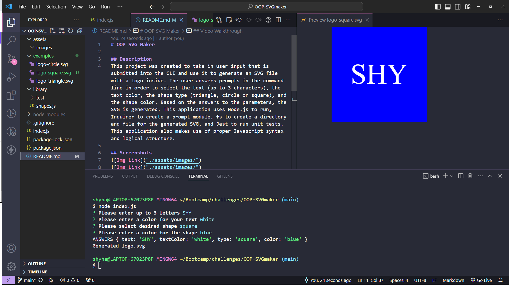
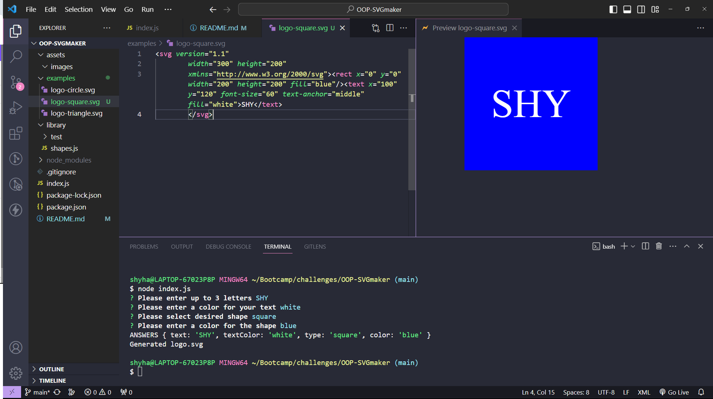

# OOP SVG Maker

## Description
This project was created to take in user input that is submitted into the CLI and use it to generate an svg file with a logo inside. The user answers prompts in the command line in order to select the text (up to 3 letters), the text color, the shape type, and the shape color. Based on the answers to these parameters, the SVG is generated. This application uses Node.js to run, Inquirer to create a prompt module, fs to create a directory and file for the generated SVG, and Jest to run unit tests.

## Screenshots

## Video Walkthrough
[Video Link](https://drive.google.com/file/d/1NUcYap6O6h9NBvMKLE65uh8rZcThjuXY/view?usp=sharing)

## Links
[Github Repo Link](https://github.com/sailorshy94/OOP-SVGmaker)  